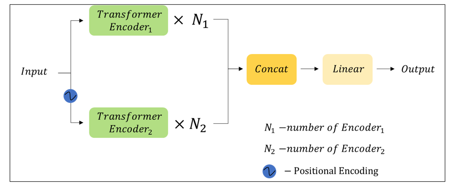

# Multivariative Time Series Classification Transformer (MTSCT)


## Description

This repository contains a new transformer architecture for multivariative time series classification tasks, as well as a tool for automatic hyperparameter tuning of the model. This architecture has been tested on the [UEA dataset](https://arxiv.org/pdf/1811.00075) and demonstrated superior performance on 13 out of 30 datasets and higher average accuracy.

## Architecture of the Developed Model

The key idea of the developed architecture is that patterns are sought not only along each dimension of the time series but also between dimensions. Patches (i.e., subsequences of series) serve as embeddings.

The code for the model architecture is presented in the file `src/model.py`.



## Tool for Automatic Hyperparameter Tuning

This tool allows finding the best combination of data preprocessing parameters and model hyperparameters.

All the hyperparameters to be tuned and their variations are specified in the `config.json` file.

## Usage

To run automatic hyperparameter tuning, data in `arff` format is required as multivariative time series.

### Running from the command line

```
python main.py --mode {train,test_params,test_model} --output_folder OUTPUT_FOLDER [--model_path MODEL_PATH] [--params_file_path PARAMS_FILE_PATH] --config_path CONFIG_PATH [--train_path TRAIN_PATH] --test_path TEST_PATH
```

### Running from the interface

1. `python gui.py`
2. Choose the mode
3. Load all necessary data
4. Click `Run`

## Comparison with SOTA Model

The state-of-the-art (SOTA) model for multivariative time series classification is [DyFormer](https://arxiv.org/pdf/2111.10447). Comparison was conducted on the test set using the `accuracy` metric.


| DS Name                   | Dyformer    |  MTSCT              |
|---------------------------|-------------|----------------------|
| ArticularyWordRecognition | 0,997       | 0,9933               |
| AtrialFibrillation        | 0,267       | **0,6**              |
| BasicMotions              | 1           | **1**                |
| CharacterTrajectories     | 0,999       | 0,9854               |
| Cricket                   | 1           | 0,9861               |
| DuckDuckGeese             | 0,788       | **0,82**             |
| EigenWorms                | 0,901       | **0,92**             |
| Epilepsy                  | 1           | **1**                |
| Ering                     | 0,97        | **0,9704**           |
| EthanolConcentration      | 0,397       | 0,3802               |
| FaceDetection             | 0,732       | 0,6833               |
| FingerMovements           | 0,65        | **0,69**             |
| HandMovementDirection     | 0,459       | **0,7162**           |
| HandWriting               | 0,593       | 0,3165               |
| HeartBeat                 | 0,816       | 0,7805               |
| JapaneseVowels            | 0,989       | 0,9703               |
| Libras                    | 0,944       | 0,9111               |
| LSST                      | 0,758       | 0,6176               |
| MotorImagery              | 0,64        | **0,68**             |
| NATOPS                    | 0,933       | **0,9611**           |
| PEMS-SF                   | 0,952       | 0,8382               |
| PenDigits                 | 0,997       | 0,9626               |
| Phoneme                   | 0,309       | 0,2183               |
| RacketSports              | 0,954       | 0,9013               |
| SelfRegulationSCP1        | 0,944       | 0,9386               |
| SelfRegulationSCP2        | 0,628       | **0,6333**           |
| SpokenArabicDigits        | 0,996       | 0,9909               |
| StandWalkJump             | 0,433       | **0,7333**           |
| UWaveGestureLibrary       | 0,962       | 0,9062               |
| InsectWingBeat            | 0,711       | **0,7232**           |
| Mean                      | 0,790633333 | **0,7942**           |


